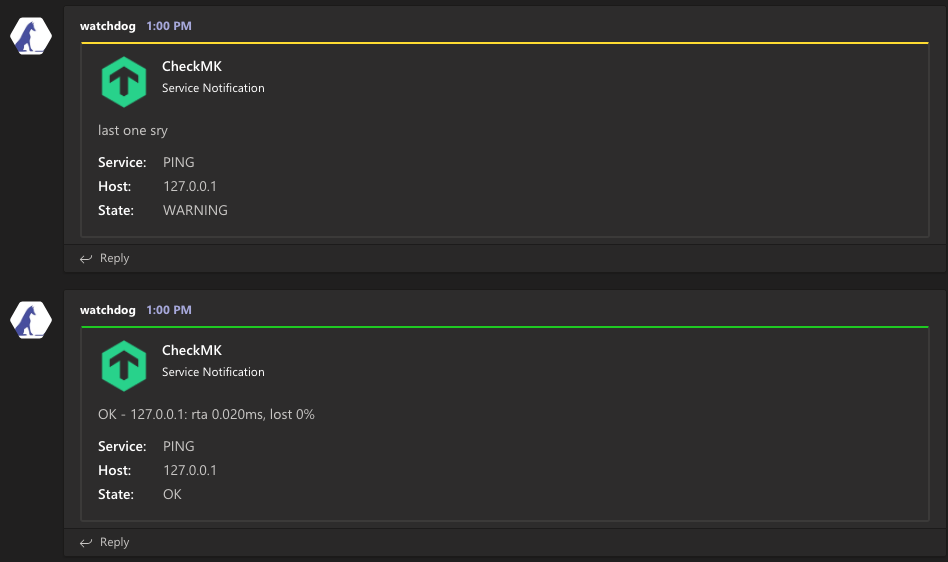

# checkmk-notify-teams

if you (unfortunately) find yourself utilizing Microsoft Teams incoming webhooks & need to send alerts from CheckMK, you can use this. utilizes params in UI to set the webhook url so you can send to different channels / don't hardcore webhook

## setup

- clone / copy teams.py & put in `/omd/sites/{your_site}/local/share/check_mk/notifications`
- ensure it's executable (`chmod +x teams.py`)
- setup notification. method = 'Notify via Microsoft Teams', param = teams channel webhook

## Credits

checkmk team -- this is a modified version of their slack webhook plugin
